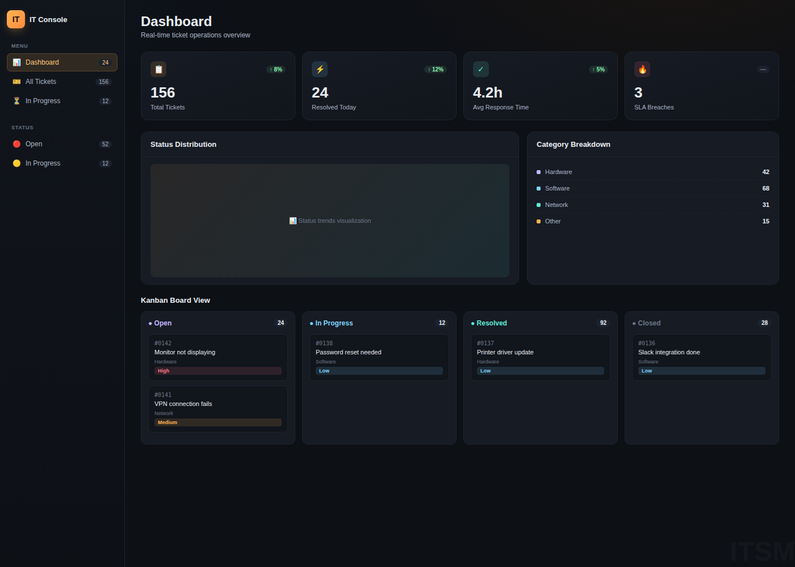
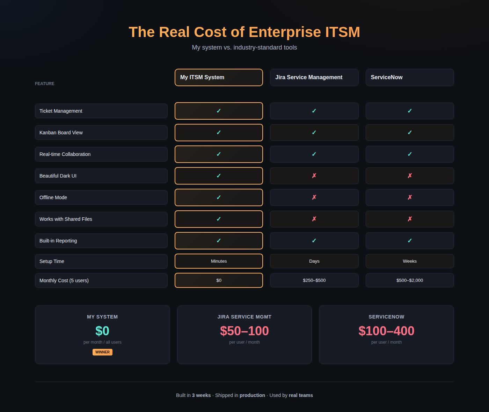
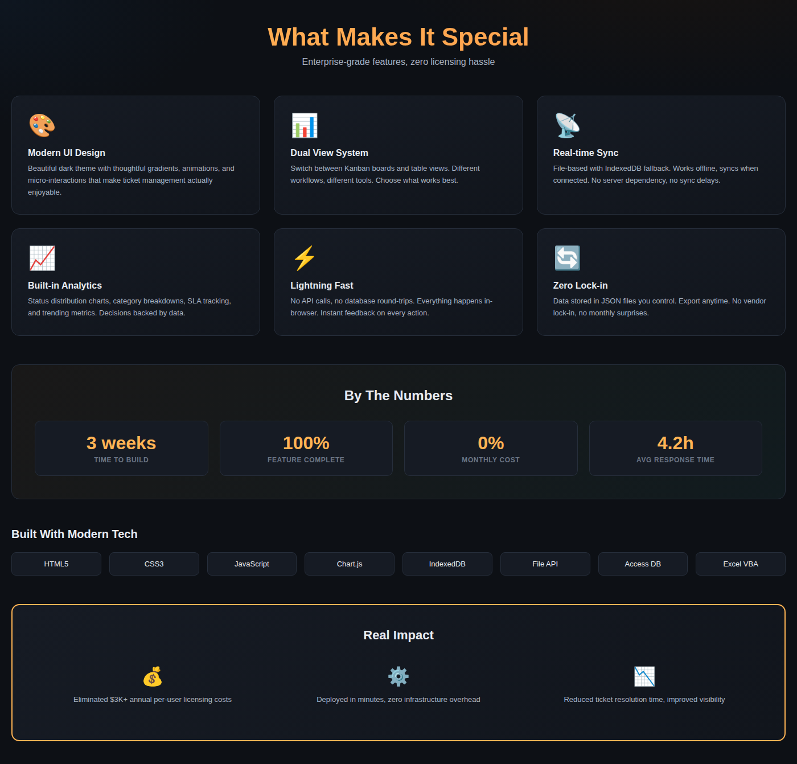

# TechExperiment 🚀

A modern, lightweight ITSM system built to replace expensive enterprise tools.

---

## 🎯 The Problem

We were wasting $8K+ a year on an ITSM tool we barely used.

Our IT team needed better ticket management. The obvious choice? Jira Service Management or ServiceNow. But the licensing costs were brutal.

So I decided to build our own.

---

## ✨ Features

- Kanban + Table Views  
- Real-time Collaboration  
- Built-in Analytics  
- Offline Mode  
- Beautiful Dark UI  

---

## 📸 Screenshots

### Dashboard

### Comparison

### Features

---

## 📊 Results

- Zero licensing cost  
- Faster than enterprise tools  
- Used in real scenarios  

---

## ⚠️ Note

This is a portfolio project. Source code is not public.
